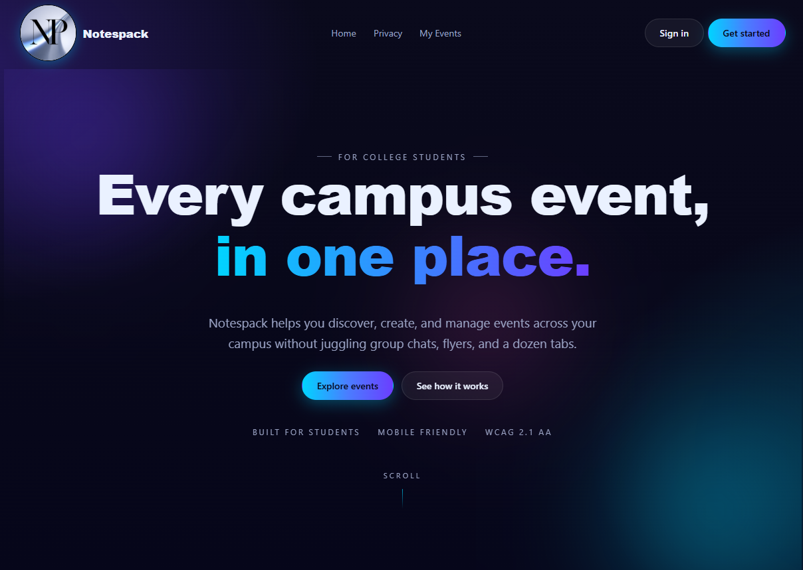
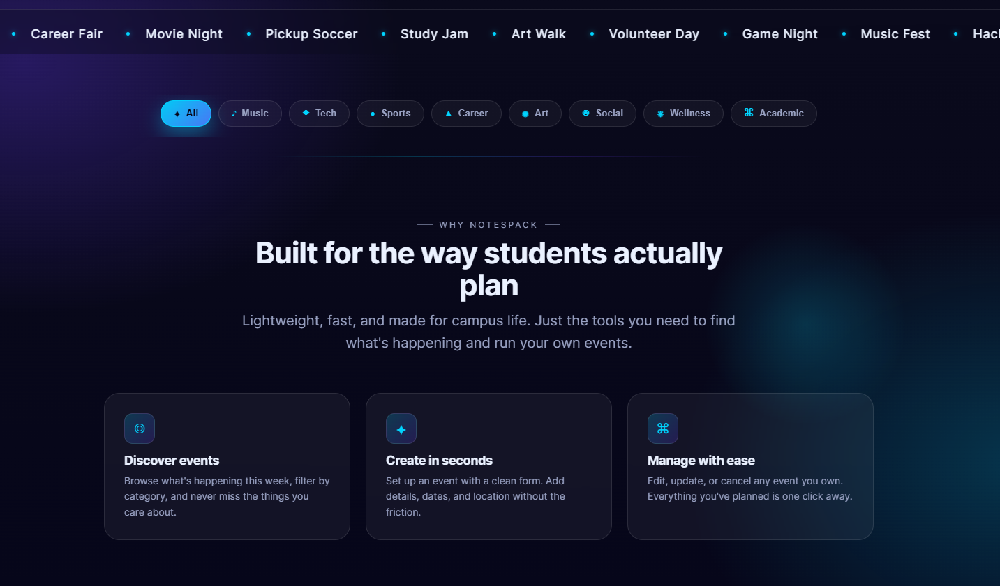
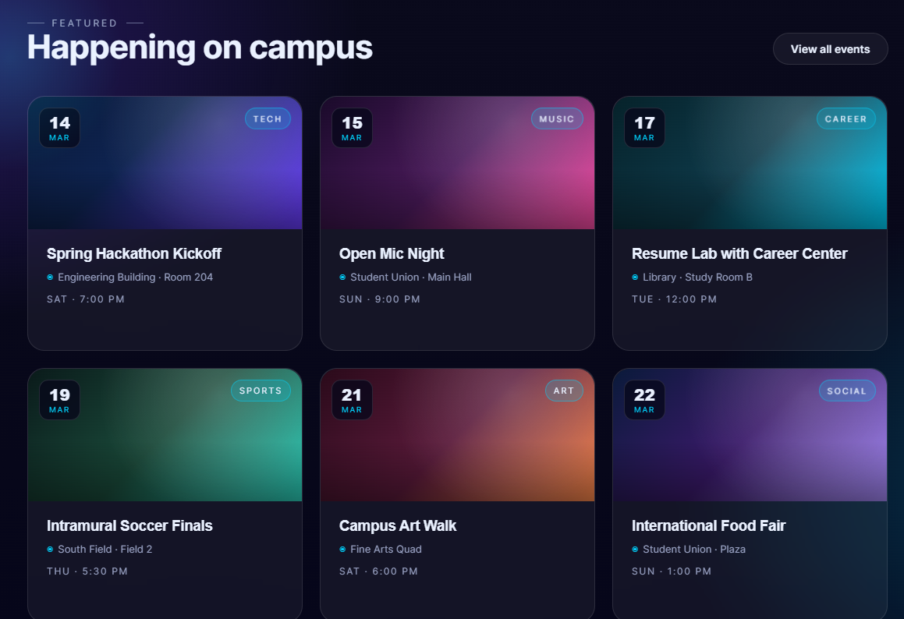
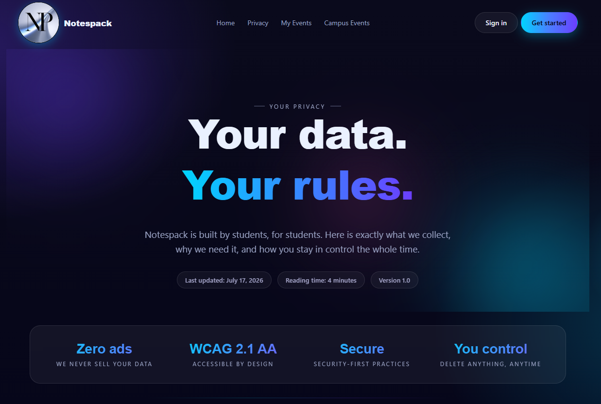
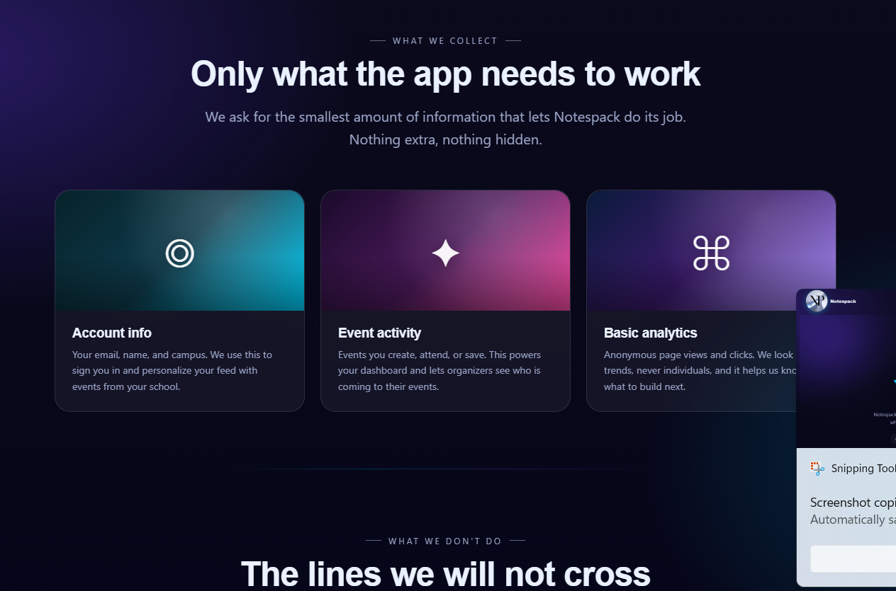
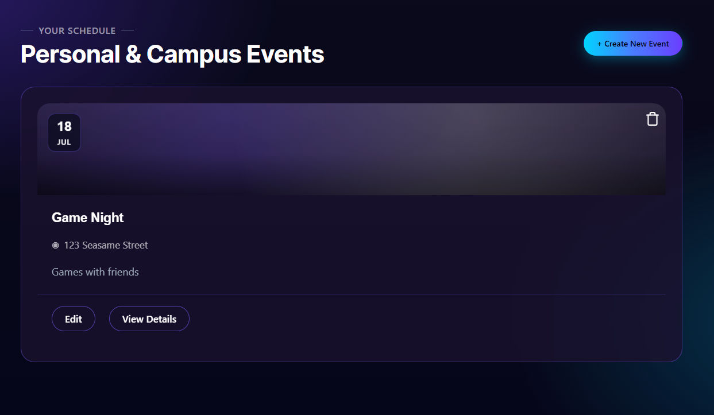
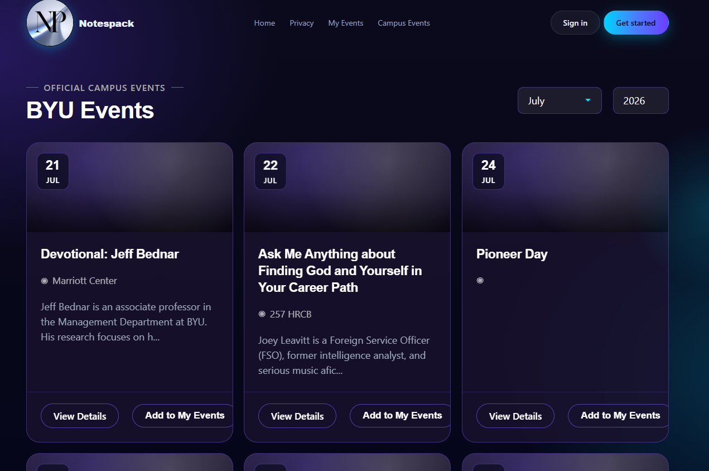
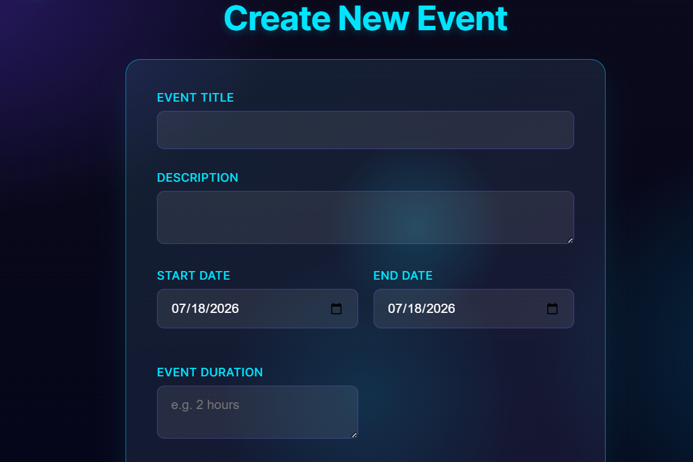
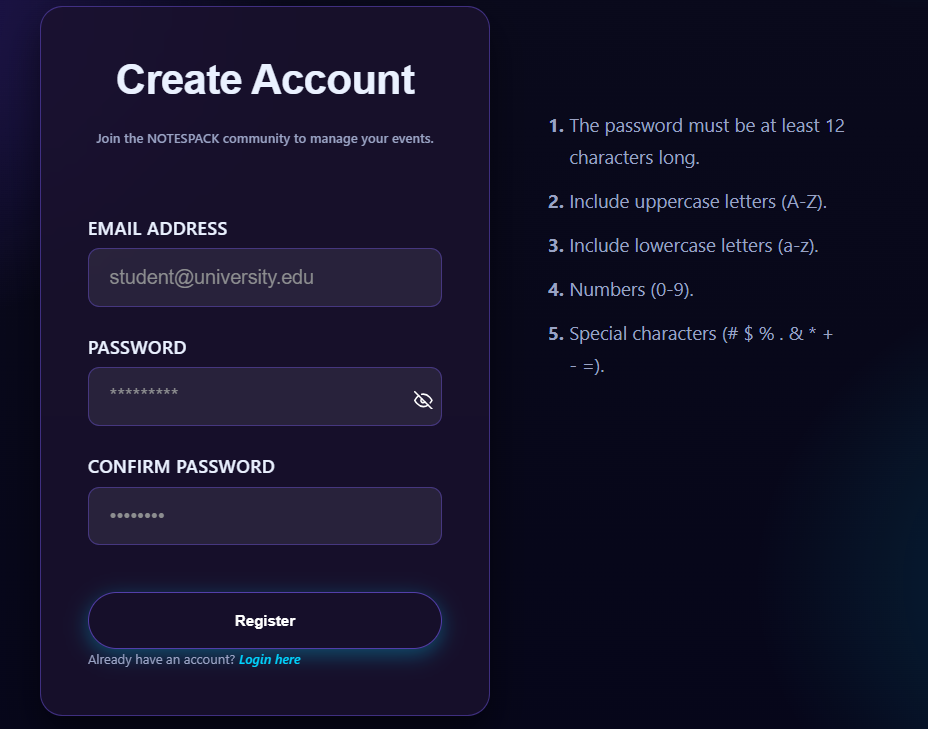
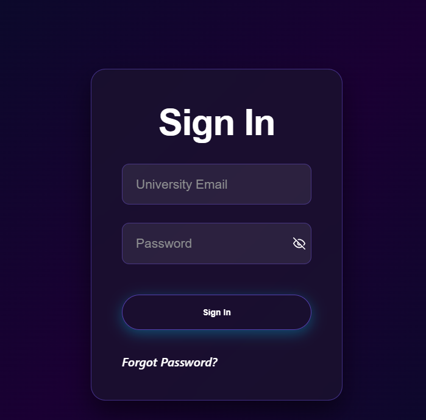

<div align="center">


  
  <h1>Notespack</h1>
  <p>
  A .NET Blazor web application designed to help college students discover, create, and manage campus and community events in one organized place.
  </p>
   
<h4>
    <a href="https://github.com/Joeykmoore13/Notespack">View Demo</a>
  <span> · </span>
    <a href="https://github.com/Joeykmoore13/Notespack/tree/main/docs">Documentation</a>
  <span> · </span>
    <a href="https://github.com/Joeykmoore13/Notespack/issues/">Report Bug</a>
  <span> · </span>
    <a href="https://github.com/Joeykmoore13/Notespack/issues/">Request Feature</a>
  </h4>
</div>

<br />


<!-- Table of Contents -->
# Table of Contents

- [About the Project](#about-the-project)
  * [Screenshots](#screenshots)
  * [Tech Stack](#tech-stack)
  * [Features](#features)
- [Getting Started](#getting-started)
  * [Prerequisites](#prerequisites)
  * [Clone Repo](#clone-repository)
  * [Build](#build)
  * [Run](#run)
- [Documentation](#documentation)
- [Roadmap](#roadmap)
- [Team](#team)
- [Contact](#contact)
- [License](#license)
  

<!-- About the Project -->
## About the Project

Notespack is a web application developed by The Syntax Errors to simplify event management for college students.

Users can:
- Browse upcoming events.
- Create and manage events.
- Search and filter events.
- Register and log into accounts.
- View detailed event information.

The application was built using .NET Blazor and SQL Server with a focus on accessibility, responsiveness, and usability.


<!-- Screenshots -->
## Screenshots

### Home Page

<div>
  
</div>

<div>
  
</div>

<div>
  
</div>

### Privacy Page

<div>
  
</div>
---
<div>
  
</div>

### Events Page

<div>
  
</div>

<div>
  
</div>

### Create Event

<div>
  
</div>

### Login/Register

<div>
  
</div>

<div>
  
</div>


<!-- TechStack -->
## Tech Stack

### Frontend
- .NET 8
- Blazor
- Bootstrap 5

### Backend
- ASP.NET Core
- C#

### Database
- SQL Server

### Development Tools
- Visual Studio 2022 or Visual Studio Code
- GitHub
- Jira

### Deployment
- Azure / Render / AWS


<!-- Features -->
## Features

- User registration and authentication.
- Create, edit, and delete events.
- Browse upcoming events.
- Search and filter events.
- Responsive design for desktop and mobile.
- Accessible interface following WCAG guidelines.
- Cloud deployment.

<!-- Getting Started -->
## Getting Started

<!-- Prerequisites -->
### Prerequisites

- .NET 8 SDK
- Visual Studio 2022
- SQL Server
- Git

### Clone Repository

```bash
git clone https://github.com/Joeykmoore13/Notespack.git
```

### Build

```bash
dotnet build
```

### Run

```bash
dotnet run
```

<!-- Documentation -->
## Documentation

Additional project documentation:

- [Requirements](doc/Requirements.md)
- [Test Plan](doc/QA.md)
- [User Guide](doc/UserGuide.md)
- [GitHub Issues](https://github.com/Joeykmoore13/Notespack/issues)


<!-- Roadmap -->
## Roadmap

- [x] Project planning
- [x] UI design
- [x] Database design
- [x] User authentication
- [x] Event CRUD operations
- [x] Search and filtering
- [x] Responsive design
- [x] Accessibility improvements
- [ ] QA testing
- [ ] Cloud deployment
- [ ] Final project presentation

<!-- Team/Roles -->
## Team

| Member | Role |
|---------|--------|
| Joey Moore | Full Stack |
| Marco Quintero | Frontend |
| Melissa Dickerson | Authentication & QA Documentation |
| Rebeca Garcia Perez | Frontend |
| Rosana Garcia Perez | Backend |

<!-- Contact -->
## Contact

| Member | GitHub |
|---------|--|
| Joey Moore | https://github.com/Joeykmoore13 |
| Marco Quintero | https://github.com/marcoq10x |
| Melissa Dickerson | https://github.com/Melissard02 |
| Rebeca Garcia Perez | https://github.com/rbkgarcia |
| Rosana Garcia Perez | https://github.com/RosanaGarciap |

<!-- License -->
## License
This project was developed for educational purposes as part of a college capstone project.